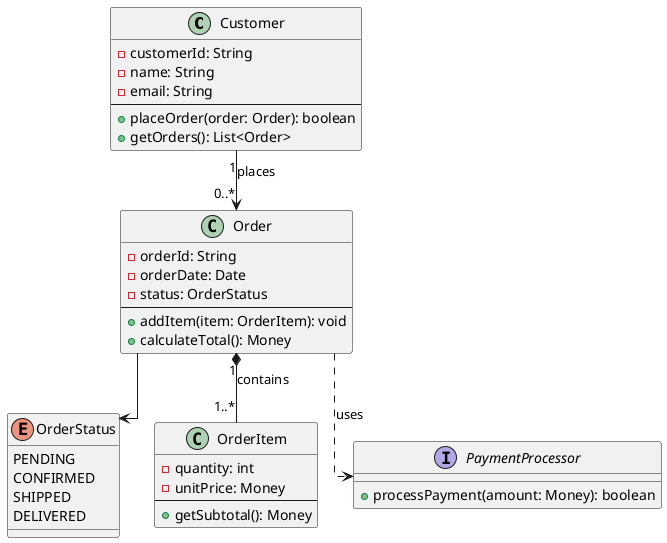

# UML Diagrams

## Core Principles

1. **Strict UML Compliance**: Follow UML 2.5 specification precisely
2. **Tool Preference**: Use PlantUML syntax exclusively
3. **Visual Style**: Apply orthogonal (polyline) routing and plain theme
   `!theme plain`
4. **Clarity**: Prioritize readability and correct notation over aesthetics

## General PlantUML Configuration

Every diagram must include these directives:

```plantuml
@startuml
!theme plain
skinparam linetype ortho

' Your diagram content here

@enduml
```

## Diagram Types & Canonical Rules

### 1. Class Diagrams

**Purpose**: Show static structure of classes, attributes, operations, and
relationships

**Syntax Rules**:

```plantuml
class ClassName {
  - privateAttribute: Type
  # protectedAttribute: Type
  + publicAttribute: Type
  ~ packageAttribute: Type
  --
  - privateMethod(): ReturnType
  + publicMethod(param: Type): ReturnType
  {abstract} abstractMethod(): Type
  {static} staticMethod(): Type
}
```

**Visibility Markers**:

- `-` private
- `+` public
- `#` protected
- `~` package/internal

**Relationships** (correct UML semantics):

- `<|--` Inheritance/Generalization (filled triangle)
- `<|..` Realization/Implementation (hollow triangle, dashed)
- `*--` Composition (filled diamond) - strong ownership
- `o--` Aggregation (hollow diamond) - weak ownership
- `-->` Association (simple arrow)
- `..>` Dependency (dashed arrow)

**Multiplicity**: Always specify when relevant

```plantuml
Class1 "1" --> "0..*" Class2
Class3 "1" *-- "1..4" Class4
```

**Abstract Classes & Interfaces**:

```plantuml
abstract class AbstractClass {
  {abstract} operation()
}

interface InterfaceName {
  operation()
}
```

### 2. Sequence Diagrams

**Purpose**: Show interactions between objects over time

**Syntax Rules**:

```plantuml
actor User
participant "SystemName" as Sys
database DB
collections Group

User -> Sys: request()
activate Sys
Sys -> DB: query()
activate DB
DB --> Sys: result
deactivate DB
Sys --> User: response
deactivate Sys
```

**Key Elements**:

- `->` Synchronous message (solid line)
- `-->` Return message (dashed line)
- `->>` Asynchronous message
- `activate`/`deactivate` for execution specifications
- `alt`/`else`/`opt`/`loop`/`par` for combined fragments

**Combined Fragments**:

```plantuml
alt successful case
  A -> B: request
  B --> A: success
else failure case
  A -> B: request
  B --> A: error
end
```

### 3. Use Case Diagrams

**Purpose**: Show functional requirements from user perspective

**Syntax Rules**:

```plantuml
left to right direction

actor User
actor Admin

rectangle System {
  usecase UC1 as "Use Case Name"
  usecase UC2 as "Another Use Case"

  User --> UC1
  Admin --> UC2

  UC1 ..> UC2 : <<include>>
  UC1 <.. UC3 : <<extend>>
}
```

**Relationships**:

- `-->` Association (actor to use case)
- `<|--` Generalization
- `..>` with `<<include>>` stereotype (mandatory)
- `<..` with `<<extend>>` stereotype (optional)

### 4. Activity Diagrams

**Purpose**: Show workflow and business process logic

**Syntax Rules**:

```plantuml
start

:Activity 1;

if (Condition?) then (yes)
  :Activity 2;
else (no)
  :Activity 3;
endif

fork
  :Parallel Activity 1;
fork again
  :Parallel Activity 2;
end fork

:Final Activity;

stop
```

**Key Elements**:

- `:Activity;` for actions
- `if`/`then`/`else`/`endif` for decisions
- `fork`/`fork again`/`end fork` for parallelism
- `start` and `stop` for initial/final nodes
- `partition` for swim lanes

### 5. State Machine Diagrams

**Purpose**: Show states and transitions of an object

**Syntax Rules**:

```plantuml
[*] --> State1

State1 : entry / entryAction
State1 : do / activity
State1 : exit / exitAction

State1 --> State2 : event [guard] / action

state State3 {
  [*] --> SubState1
  SubState1 --> SubState2
  SubState2 --> [*]
}

State2 --> [*]
```

**Elements**:

- `[*]` for initial/final pseudo-states
- `:` for internal behaviors (entry/exit/do)
- Transition format: `source --> target : event [guard] / action`

### 6. Component Diagrams

**Purpose**: Show organization of physical components

**Syntax Rules**:

```plantuml
component [ComponentName] as C1
interface "InterfaceName" as I1

C1 -( I1 : provides
C1 ..> I1 : requires

package "Package Name" {
  [Component2]
}

C1 --> [Component2]
```

### 7. Deployment Diagrams

**Purpose**: Show physical deployment of artifacts

**Syntax Rules**:

```plantuml
node "ServerNode" {
  artifact "application.jar"
  component [AppServer]
}

node "ClientNode" {
  component [Browser]
}

[Browser] --> [AppServer] : HTTP
```

## Best Practices

### Naming Conventions

1. **Classes**: PascalCase (`CustomerAccount`)
2. **Attributes/Methods**: camelCase (`calculateTotal()`)
3. **Constants**: UPPER_SNAKE_CASE (`MAX_VALUE`)
4. **Packages**: lowercase (`com.example.model`)

### Layout Optimization

```plantuml
' Control direction
left to right direction
' or
top to bottom direction

' Hide specific elements if cluttered
hide empty members
hide circle
hide stereotype
```

### Stereotypes (when appropriate)

```plantuml
class Service <<service>>
class Entity <<entity>>
interface Repository <<interface>>
```

### Notes and Comments

```plantuml
note right of ClassName
  Important information
  about this class
end note

note "Floating note" as N1
```

## Common Errors to Avoid

1. **Wrong arrow direction for inheritance**: Use `<|--` not `--|>`
2. **Confusing association and dependency**: Association is structural,
   dependency is usage
3. **Incorrect composition/aggregation**: Composition implies lifecycle
   ownership
4. **Missing multiplicities**: Always specify in associations
5. **Improper interface realization**: Use dashed line with hollow triangle
   `<|..`
6. **Sequence diagram activation without deactivation**: Always balance
   activate/deactivate
7. **Missing stereotypes on include/extend**: Use case extensions require
   `<<include>>` or `<<extend>>`

## Complete Example



## Validation Checklist

Before finalizing any UML diagram, verify:

- [ ] All relationships use correct UML notation
- [ ] Visibility markers are appropriate
- [ ] Multiplicities are specified where relevant
- [ ] Stereotypes are used correctly
- [ ] Names follow conventions
- [ ] Diagram serves its intended purpose clearly
- [ ] No UML specification violations
